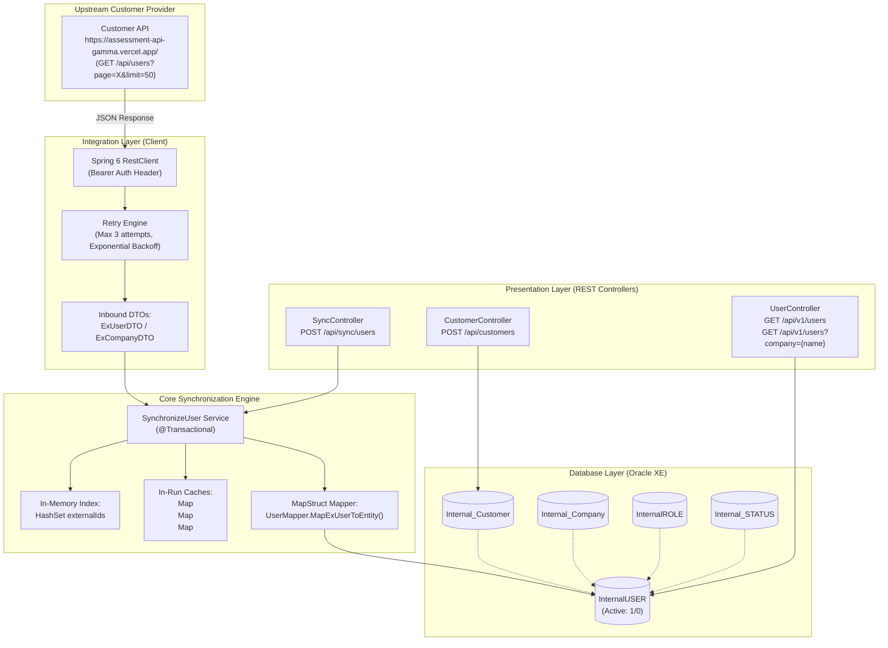
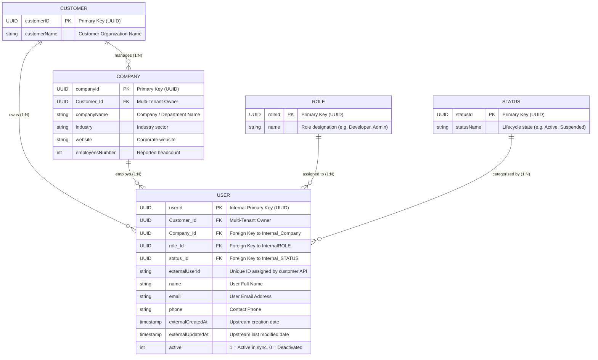
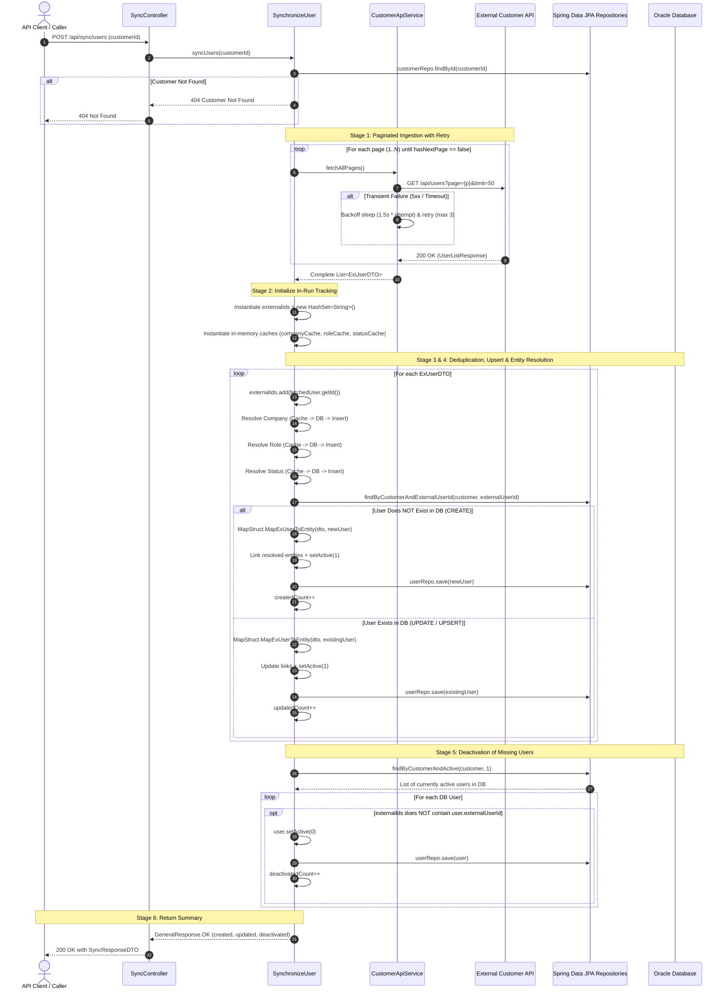
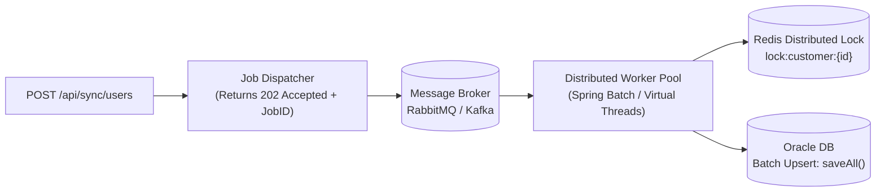

# System Design Document – User Synchronization Service

**Project**:  API integration
**Author**: Fatma El Mahdi  
**Date**: September 2026  
**Status**: Implemented & Documented for Engineering Review  

---

## Table of Contents
1. [Introduction & Business Context](#1-introduction--business-context)
2. [Architectural Philosophy & Design Principles](#2-architectural-philosophy--design-principles)
3. [End-to-End System Architecture](#3-end-to-end-system-architecture)
4. [Domain Model & Entity-Relationship Architecture](#4-domain-model--entity-relationship-architecture)
5. [The Ingestion & Synchronization Engine](#5-the-ingestion--synchronization-engine)
6. [Brainstorming Deep-Dive & Engineering Dilemmas](#6-brainstorming-deep-dive--engineering-dilemmas)
   - [Dilemma 1: Duplicate Handling (409 Conflict vs. Idempotent Upsert)](#dilemma-1-duplicate-handling-409-conflict-vs-idempotent-upsert)
   - [Dilemma 2: Database Cleanup & Missing Record Reconciliation](#dilemma-2-database-cleanup--missing-record-reconciliation)
   - [Dilemma 3: Dynamic Entity Resolution & The N+1 Query Problem](#dilemma-3-dynamic-entity-resolution--the-n1-query-problem)
   - [Dilemma 4: Upstream API Authentication & Tenant Scoping](#dilemma-4-upstream-api-authentication--tenant-scoping)
   - [Dilemma 5: Data Decoupling & Boundary Protection](#dilemma-5-data-decoupling--boundary-protection)
7. [API Contract & Response Design](#7-api-contract--response-design)
8. [Resilience, Fault Tolerance & Transaction Management](#8-resilience-fault-tolerance--transaction-management)
9. [Scalability & Future Production Roadmap](#9-scalability--future-production-roadmap)

---

## 1. Introduction & Business Context

### 1.1 The Scenario
The service acts as an integration gateway between an external customer identity provider (`https://assessment-api-gamma.vercel.app/`) and our internal platform. 

The external API provides paginated user profiles containing:
- User personal information (Name, Email, Phone, external IDs, timestamps).
- Organization details (Company Name, Industry, Website, Employee Count).
- User organizational role and lifecycle status.

### 1.2 Core Business Requirements
1. **Customer Registration**: Register a customer organization with a URL and identifier.
2. **Automated User Synchronization**: Traverse the customer's external API, ingest all active user records, and store them in our relational database.
3. **Strict Deduplication**: Ensure that a user only exists once in our database.
4. **Data Model Decoupling**: Keep external API payload schemas completely isolated from internal database models and client-facing API responses.
5. **Reconciliation & State Synchronization**: Maintain consistency between the external system and our database when users are modified or removed.
6. **Internal Query APIs**: Expose REST endpoints to retrieve users with support for filtering by company.

---

## 2. Architectural Philosophy & Design Principles

The design is governed by five foundational software engineering principles:

1. **Clean Layered Architecture**: Strict separation of concerns across Presentation (`Controller`), Domain Logic (`Service`), Persistence (`Repo`), and Integration (`Client`).
2. **DTO Isolation Boundary**: Neither the external API DTOs nor internal JPA Entities are ever leaked to public REST consumers. MapStruct handles compile-time transformations.
3. **Multi-Tenant Data Partitioning**: All synced entities (`User`, `Company`) are explicitly scoped to a `Customer` parent ID to prevent cross-tenant data pollution.
4. **Idempotency by Default**: Synchronization endpoints must be safely retryable without producing duplicate records, corrupting state, or triggering false-positive errors.
5. **Non-Destructive Reconciliation**: When upstream entities disappear, soft deactivation (`active = 0`) is preferred over irreversible SQL `DELETE` operations to maintain relational integrity and audit trails.

---

## 3. End-to-End System Architecture



---

## 4. Domain Model & Entity-Relationship Architecture

The relational schema is intentionally normalized to 3NF (Third Normal Form) to avoid data redundancy and maintain consistency across company names, roles, and statuses.

### 4.1 ER Diagram



### 4.2 Database Decisions & Constraints
1. **UUID Primary Keys**: All internal entities use standard RFC 4122 UUIDs generated via Hibernate's `GenerationType.UUID`. This guarantees globally unique IDs without database sequence contention.
2. **Tenant Scoping**: All users and companies maintain a non-nullable foreign key to `Internal_Customer`.
3. **Soft-Delete Flag (`active`)**: Rather than executing physical `DELETE` statements, a binary column (`active = 1` or `active = 0`) tracks user presence.

---

## 5. The Ingestion & Synchronization Engine

The synchronization process is orchestrated by `SynchronizeUser.java` and follows a deterministic 7-stage lifecycle:



---

## 6. Brainstorming Deep-Dive & Engineering Dilemmas

During the design and implementation of this service, several key design dilemmas and edge cases emerged from analyzing the assessment brief and handwritten notes. Here is the rationale behind each technical decision:

---

### Dilemma 1: Duplicate Handling (409 Conflict vs. Idempotent Upsert)

#### The Conflict in the Requirements:
The requirement note states:
> *"A user should only exist once in our database. (check if any duplicates return 409 conflict error if any issue) -> HashSet: only get User once and store it"*

In REST architecture, an HTTP `409 Conflict` indicates an illegal state conflict (e.g. attempting to create a resource that already exists with the same unique key). However, in ETL and synchronization systems:
- If a sync runs today, it ingests 50 users.
- When the sync runs tomorrow, it will re-fetch those same 50 users plus 5 new ones.
- If finding an existing user throws a `409 Conflict`, the sync would **fail immediately on every subsequent execution**, making automated or scheduled synchronization impossible.

#### The Architectural Solution Implemented:
We reconciled these two needs through a dual-layer strategy:
1. **Intra-Batch Deduplication via `HashSet<String>`**:
   If the upstream API returns duplicate records within the same batch/pages, `externalIds.add(id)` and per-user deduplication ensures that each external user ID is only processed once per sync run.
2. **Database Idempotent Upsert**:
   The service queries `findByCustomerAndExternalUserId(customer, externalUserId)`:
   - If the user is new: Insert with `active = 1` (`created++`).
   - If the user already exists: Update their attributes with the latest upstream data and maintain `active = 1` (`updated++`).
3. **Conflict Handling for Manual Actions**:
   The `ResponseStatus.CONFLICT` status code was defined in the enum so that direct manual user creation or customer duplicate registration can return `409 Conflict` whenever a duplicate key is intentionally prohibited.

---

### Dilemma 2: Database Cleanup & Missing Record Reconciliation

#### The Problem:
A note on the assessment sheet asked:
> *"*** Probably I can add another Method later, like cleaning up my own DATA BASE? 🧐💭"*

When synchronizing state from an external source, what should happen to users who existed during the previous sync run, but are **no longer present** in the external customer API (e.g., an employee left the company or was deleted)?

#### Options Considered:
| Approach | Mechanism | Pros | Cons |
|---|---|---|---|
| **Hard Delete** | `userRepo.delete(user)` | Keeps DB small; exact mirror of upstream. | Destroys historical audit logs; causes foreign-key constraint violations on child records. |
| **Do Nothing** | Leave records as-is | Simplest implementation. | Ghost users remain active in our system indefinitely. |
| **Soft Deactivation (Selected)** | `user.setActive(0)` | Non-destructive; preserves audit history; supports reactivation. | Requires filtering `active = 1` on queries. |

#### The Architectural Solution Implemented:
We implemented the `deactivateMissingUsers()` method in `SynchronizeUser.java`:
1. As external users are processed, their `externalUserId`s are collected in `HashSet<String> externalIds`.
2. After the ingestion loop, the service queries all active users in our database for that customer (`findByCustomerAndActive(customer, 1)`).
3. Any user whose `externalUserId` is absent from `externalIds` is marked `active = 0` (`deactivated++`).
4. If that user reappears in a future sync, the upsert logic automatically flips `active = 1`.

---

### Dilemma 3: Dynamic Entity Resolution & The N+1 Query Problem

#### The Problem:
The external API provides flat nested objects inside each user:
```json
"company": {
    "name": "Acme Corp",
    "industry": "Software",
    "role": "Lead Architect",
    "website": "https://acme.com",
    "employees": 120
}
```
If we have 500 users, and each user belongs to `"Acme Corp"`, executing a database `SELECT` and potentially `INSERT` for company, role, and status on every user would trigger:
$$500 \times 3 = 1,500\text{ database roundtrips}$$
This causes severe database latency and connection pool exhaustion.

#### The Architectural Solution Implemented:
We implemented **In-Run Ephemeral Caches**:
```java
Map<String, Company> companyCache = new HashMap<>();
Map<String, Role> roleCache = new HashMap<>();
Map<String, Status> statusCache = new HashMap<>();
```
When `resolveCompany(companyName)` is called:
1. First, check `companyCache.get(companyName)`. If found, return instantly ($O(1)$ in-memory).
2. If absent from cache, query database via `_companyRepo.findByCompanyNameIgnoreCase(companyName)`.
3. If absent from DB, instantiate, persist, and populate both the database and the cache.

This reduced database roundtrips from $O(N)$ to $O(K)$, where $K$ is the number of distinct companies/roles ($K \ll N$).

---

### Dilemma 4: Upstream API Authentication & Tenant Scoping

#### The Brainstorming Observation:
In `CustomerConfig.java`, the code comments raised the question:
> `//how iam getting authentication`  
> `// accessing the customer API:putting it into: HTTP header format`  
> `// HOW I KNOW IF THIS USER REALLY AUTHENTICATED ?????`

#### The Architectural Analysis:
In the assessment flow:
1. `POST /api/customers` creates a customer and returns a `customerID` (UUID).
2. `POST /api/sync/users` takes that `customerID` to trigger user synchronization.
3. The HTTP client attaches `Authorization: Bearer ${CUSTOMER_API_TOKEN}` to external requests.

#### Production Solution & Future Multi-Tenant Evolution:
- **Currently**: The token is securely injected via Spring environment variables (`customer.api.token=${CUSTOMER_API_TOKEN}`). If the token is invalid or expired, the upstream API returns `401 Unauthorized`, which is caught by `CustomerApiService` and returned as `502 BAD GATEWAY` with an explicit message.
- **Production Architecture**: In a multi-tenant SaaS deployment, each customer organization will supply their own dynamic API credentials during registration (`POST /api/customers`), which will be encrypted (AES-256) in `Internal_Customer.api_token` and injected per-request into the `RestClient`.

---

### Dilemma 5: Data Decoupling & Boundary Protection

#### The Principle:
The application strictly respects the **Boundary Protection Rule**:
1. **External Contract (`DTO/External`)**: `ExUserDTO`, `ExCompanyDTO`, `ExPaginationDTO` reflect the exact JSON schema of `assessment-api-gamma.vercel.app`.
2. **Persistence Entities (`Model/`)**: `User`, `Company`, `Role`, `Status`, `Customer` reflect relational database tables.
3. **Internal API Contracts (`DTO/Internal`)**: `UserDTO`, `CompanyDTO`, `CustomerDTO`, `SyncResponseDTO` define what internal and frontend clients consume.

#### Why MapStruct?
Rather than using runtime reflection libraries (like ModelMapper) or manual boilerplate code, **MapStruct 1.7** generates compile-time, zero-overhead Java bytecode:
```java
@Mapper(componentModel = "spring")
public interface UserMapper {
    @Mapping(source = "id", target = "externalUserId")
    @Mapping(source = "createdAt", target = "externalCreatedAt")
    @Mapping(source = "updatedAt", target = "externalUpdatedAt")
    void MapExUserToEntity(ExUserDTO ExternalUserDTO, @MappingTarget User user);
}
```
This guarantees compile-time type safety and prevents API contract changes from breaking internal models.

---

## 7. API Contract & Response Design

All REST endpoints return a unified response envelope `GeneralResponse<T>`:

```json
{
  "response": "OK | CREATED | BAD_REQUEST | CONFLICT | BAD_GATEWAY | INTERNAL_SERVER_ERROR",
  "message": "Human readable status description",
  "data": { ... }
}
```

### Supported Endpoints

| Method | Path | Request Body | Response Payload | Description |
|---|---|---|---|---|
| `POST` | `/api/customers` | `CustomerDTO` | `CustomerDTO` | Registers a customer organization. |
| `POST` | `/api/sync/users` | `UUID` (customerId) | `SyncResponseDTO` | Triggers ingestion, deduplication & reconciliation. |
| `GET` | `/api/v1/users` | None | `List<UserDTO>` | Retrieves all synchronized users. |
| `GET` | `/api/v1/users?company={name}` | Query param | `List<UserDTO>` | Filters users by company name (case-insensitive substring). |

---

## 8. Resilience, Fault Tolerance & Transaction Management

1. **Exponential Backoff Retry**:
   In `CustomerApiService.fetchAllPages()`, external requests are guarded by a retry loop:
   ```java
   Thread.sleep(1500L * attempts); // 1.5s, 3.0s backoff delays
   ```
   If 3 attempts fail consecutively, the sync operation throws an exception, aborting the process cleanly.

2. **Atomic Rollback Boundaries**:
   `syncUsers()` is annotated with `@Transactional`. If an unhandled failure occurs midway through a 500-user sync, the database transaction rolls back, preventing corrupt partial imports.

3. **HTTP Status Mapping**:
   The controller translates domain outcomes into standard HTTP status codes:
   - Success $\rightarrow$ `200 OK`
   - Customer Creation $\rightarrow$ `201 CREATED`
   - Upstream Failure $\rightarrow$ `502 BAD GATEWAY`
   - Database/Unhandled Exception $\rightarrow$ `500 INTERNAL SERVER ERROR`

---

## 9. Scalability & Future Production Roadmap

If this service were to scale to millions of users across thousands of enterprise customers, the following enhancements are architecturally planned:



1. **Asynchronous Processing (`202 Accepted`)**:
   Decouple HTTP request duration from ingestion time. The endpoint returns a `jobId` immediately, and the client polls `GET /api/sync/status/{jobId}` or receives a webhook.
2. **Spring Batch with Chunking**:
   Read and write in chunks of 500 records using `hibernate.jdbc.batch_size` to eliminate individual insert roundtrips.
3. **Distributed Locking (Redisson)**:
   Prevent race conditions if two sync requests for the same customer are triggered simultaneously.
4. **Data Purge / Cleanup API**:
   Introduce `DELETE /api/sync/users/cleanup?olderThanDays=90` to allow permanent purging of soft-deleted records in accordance with GDPR / compliance policies.
