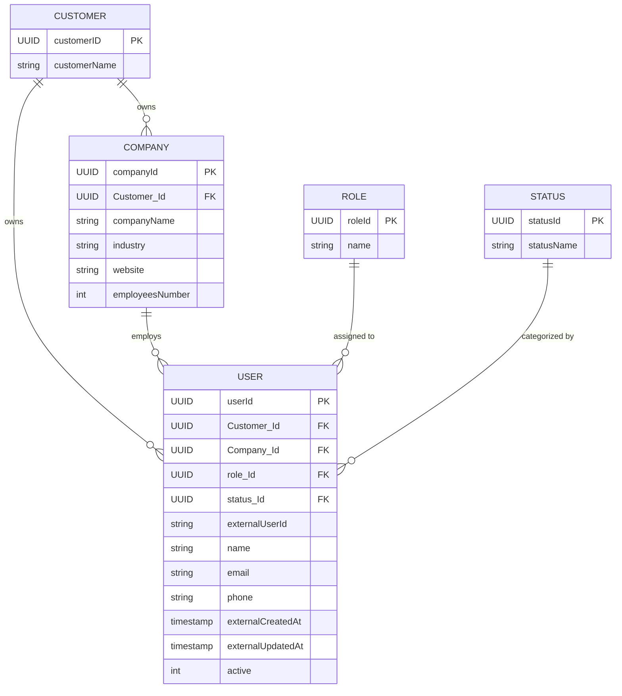

# API integration – User Synchronization Service

[](https://www.oracle.com/java/)
[](https://spring.io/projects/spring-boot)
[](https://www.oracle.com/database/)
[](https://mapstruct.org/)
[](https://swagger.io/)

A production-ready Spring Boot backend service that integrates with an external customer API, synchronizes user and organization data into a local Oracle relational database, prevents duplicate records, reconciles deactivated entities, and exposes clean, decoupled RESTful APIs for consumption.

---

## Table of Contents

- [Overview](#overview)
- [System Architecture](#system-architecture)
- [Key Features](#key-features)
- [Technology Stack](#technology-stack)
- [Data Model & ER Diagram](#data-model--er-diagram)
- [Synchronization Lifecycle & Deduplication](#synchronization-lifecycle--deduplication)
- [API Documentation](#api-documentation)
  - [1. Register Customer](#1-register-customer)
  - [2. Synchronize Users](#2-synchronize-users)
  - [3. Get All Users](#3-get-all-users)
  - [4. Filter Users by Company](#4-filter-users-by-company)
- [Project Structure](#project-structure)
- [Configuration & Setup](#configuration--setup)
- [Running the Application](#running-the-application)
- [Swagger UI & API Testing](#swagger-ui--api-testing)
- [Error Handling & HTTP Status Codes](#error-handling--http-status-codes)
- [Design Document & Clarifications](#design-document--clarifications)
- [Author](#author)

---

## Overview

In modern SaaS ecosystems, platforms must regularly ingest, normalize, and synchronize user hierarchies from third-party customer identity systems.

This service fulfills the Varthak technical assessment requirements:
1. **Third-Party Integration**: Connects to the external Customer API (`https://assessment-api-gamma.vercel.app/`) using Spring's modern, non-blocking `RestClient`.
2. **Full Pagination & Fault Tolerance**: Traverses paginated datasets automatically with built-in retry mechanisms and exponential backoff.
3. **Data Normalization & Decoupling**: Strictly isolates external contracts (`ExUserDTO`, `ExCompanyDTO`) from internal domain models (`User`, `Company`, `Role`, `Status`) using high-performance MapStruct compile-time mappers.
4. **Idempotent Synchronization & Deduplication**: Employs in-memory indexing (`HashSet`, `HashMap` caches) alongside database constraints to prevent duplicate entries and perform seamless upserts.
5. **State Reconciliation**: Detects users deleted or removed from the customer's remote API and marks them deactivated (`active = 0`).
6. **Query & Filter APIs**: Exposes internal endpoints to retrieve stored users, supporting exact and partial case-insensitive filtering by company.

---

## System Architecture

The service adheres to standard Layered Architecture and Clean Architecture principles:

```
                            +---------------------------------+
                            |      External Customer API      |
                            | assessment-api-gamma.vercel.app |
                            +---------------------------------+
                                             |
                                 [HTTP GET /api/users]
                                             v
                            +---------------------------------+
                            |       CustomerApiService        |
                            |  (RestClient + Retry / Backoff) |
                            +---------------------------------+
                                             |
                                  [List<ExUserDTO>]
                                             v
                            +---------------------------------+
                            |     SynchronizeUser Service     |
                            |  - In-memory duplicate check    |
                            |  - Entity Resolution (Company,  |
                            |    Role, Status)                |
                            |  - MapStruct Entity Mapping     |
                            |  - Missing User Deactivation    |
                            +---------------------------------+
                                             |
                             [JPA Transactions / Repositories]
                                             v
                            +---------------------------------+
                            |       Oracle XE Database        |
                            | (InternalUSER, Company, Role,..) |
                            +---------------------------------+
                                             |
                                    [Entity Retrieval]
                                             v
                            +---------------------------------+
                            |     UserService / Controller    |
                            |   (Converts Entity -> UserDTO)  |
                            +---------------------------------+
                                             |
                                 [HTTP GET /api/v1/users]
                                             v
                            +---------------------------------+
                            |          Client / SPA           |
                            +---------------------------------+
```

---

## Key Features

- **Multi-Tenant Scoping**: All imported users, companies, and roles are associated with a registered `Customer` record.
- **Dynamic Entity Resolution**: Automatically resolves or creates lookup records (`Company`, `Role`, `Status`) during the ingestion process, preventing redundant roundtrips via synchronized run caches.
- **Fail-Safe Synchronization**: Wrapped in `@Transactional` boundaries to guarantee atomicity. If a fatal external communication failure occurs after retries, changes are aborted cleanly without corrupting database state.
- **Soft Deactivation**: Avoids destructive hard deletes. Users who no longer exist in the upstream customer source are flagged as inactive (`active = 0`), preserving audit history and relational integrity.
- **Uniform API Envelopes**: All responses are wrapped in a standard `GeneralResponse<T>` containing status code, human-readable message, and typed payload.

---

## Technology Stack

| Layer / Concern | Technology | Justification |
|---|---|---|
| **Language** | Java 21 LTS | Modern records, pattern matching, performance, virtual threads compatibility |
| **Framework** | Spring Boot 3.4+ / 4.x | Robust ecosystem, DI, auto-configuration, production-ready observability |
| **HTTP Client** | Spring 6+ `RestClient` | Fluent, synchronous HTTP client replacing legacy `RestTemplate` |
| **Persistence** | Spring Data JPA / Hibernate | Type-safe repository abstraction with optimized queries |
| **Database** | Oracle Database XE | Industrial-grade relational persistence with strict ACID compliance |
| **Mapping** | MapStruct 1.7 | High-speed, compile-time, zero-reflection object mapping |
| **Documentation** | SpringDoc OpenAPI / Swagger 3 | Interactive live API documentation and testing UI |
| **Containerization** | Docker & Docker Compose | Consistent local and staging environments |

---

## Data Model & ER Diagram

The domain model cleanly separates customer tenants, organizations, user records, and lookup statuses:



---

## Synchronization Lifecycle & Deduplication

When a sync is triggered via `POST /api/sync/users` with a valid `customerId`:

```
1. Customer Validation
   └── Verify customerId exists in local database.
2. Ingestion with Auto-Pagination & Retries
   └── Fetch all pages from external endpoint (/api/users?page=X&limit=50).
   └── If a transient network glitch occurs, retry up to 3 times with exponential backoff (1.5s, 3.0s).
3. In-Memory Tracking & Deduplication
   └── HashSet<String> externalIds tracks external user IDs present in this run.
   └── Map<String, Company>, Map<String, Role>, Map<String, Status> cache lookups to minimize DB queries.
4. Per-User Processing
   ├── Look up existing user by (Customer, ExternalUserId).
   ├── IF NOT FOUND (Create):
   │     Map external DTO -> User entity via MapStruct.
   │     Link resolved Customer, Company, Role, Status.
   │     Set active = 1.
   │     Persist new record. Increment 'created'.
   └── IF FOUND (Update / Upsert):
         Update fields (name, email, phone, updated timestamps).
         Update linked relationships.
         Set active = 1 (reactivate if previously inactive).
         Persist changes. Increment 'updated'.
5. Reconciliation / Deactivation
   └── Retrieve all currently active users for this customer from DB.
   └── Any user whose externalUserId is NOT in externalIds is marked active = 0.
   └── Increment 'deactivated'.
6. Completion
   └── Commit transaction and return { created, updated, deactivated }.
```

---

## API Documentation

Base URL: `http://localhost:4040`

### 1. Register Customer
Registers a new customer account within our platform.

- **Endpoint**: `POST /api/customers`
- **Headers**: `Content-Type: application/json`
- **Request Body**:
  ```json
  {
    "customerName": "assessment-api-gamma",
    "customerURL": "https://assessment-api-gamma.vercel.app/"
  }
  ```
- **Response** (`201 Created`):
  ```json
  {
    "response": "CREATED",
    "message": "Customer has been created successfully",
    "data": {
      "customerID": "40ac987a-f34b-43dc-9a1a-1d5e52d662c3",
      "customerName": "assessment-api-gamma",
      "customerURL": "https://assessment-api-gamma.vercel.app/",
      "usersIds": [],
      "companiesIds": []
    }
  }
  ```

#### cURL Example:
```bash
curl -X POST http://localhost:4040/api/customers \
  -H "Content-Type: application/json" \
  -d '{
    "customerName": "assessment-api-gamma",
    "customerURL": "https://assessment-api-gamma.vercel.app/"
  }'
```

---

### 2. Synchronize Users
Fetches users from the external customer API, reconciles changes, and stores them in our local database.

- **Endpoint**: `POST /api/sync/users`
- **Headers**: `Content-Type: application/json`
- **Request Body**: UUID string (the Customer ID to synchronize)
  ```json
  "40ac987a-f34b-43dc-9a1a-1d5e52d662c3"
  ```
- **Response** (`200 OK`):
  ```json
  {
    "response": "OK",
    "message": "User synchronization completed successfully",
    "data": {
      "created": 45,
      "updated": 5,
      "deactivated": 2
    }
  }
  ```

#### cURL Example:
```bash
curl -X POST http://localhost:4040/api/sync/users \
  -H "Content-Type: application/json" \
  -d '"40ac987a-f34b-43dc-9a1a-1d5e52d662c3"'
```

---

### 3. Get All Users
Retrieves all synchronized users stored in our local database.

- **Endpoint**: `GET /api/v1/users`
- **Response** (`200 OK`):
  ```json
  {
    "response": "OK",
    "message": "Users retrieved successfully",
    "data": [
      {
        "userId": "b4a8e231-18e4-44cf-b962-4fdf1bf77b10",
        "customerId": "40ac987a-f34b-43dc-9a1a-1d5e52d662c3",
        "roleId": "4c3b9b4f-c003-4f9e-a89e-ec45169a92a2",
        "companyId": "f7d739d2-78d1-4db8-b57f-1d3fa54e27f0",
        "statusId": "1a3f65b8-502a-4ce6-a704-58b99d1469e7",
        "externalUserId": "usr_991823",
        "name": "Jane Doe",
        "email": "jane.doe@example.com",
        "phone": "+1-555-0199",
        "externalCreatedAt": "2024-01-15T08:30:00Z",
        "externalUpdatedAt": "2024-03-10T12:00:00Z",
        "active": 1
      }
    ]
  }
  ```

#### cURL Example:
```bash
curl -X GET http://localhost:4040/api/v1/users
```

---

### 4. Filter Users by Company
Retrieves users who belong to a company matching the specified search query (case-insensitive substring match).

- **Endpoint**: `GET /api/v1/users?company={companyName}`
- **Query Parameter**: `company` (string, e.g. `Google` or `tech`)
- **Response** (`200 OK`):
  ```json
  {
    "response": "OK",
    "message": "Users retrieved successfully",
    "data": [
      {
        "userId": "b4a8e231-18e4-44cf-b962-4fdf1bf77b10",
        "customerId": "40ac987a-f34b-43dc-9a1a-1d5e52d662c3",
        "roleId": "4c3b9b4f-c003-4f9e-a89e-ec45169a92a2",
        "companyId": "f7d739d2-78d1-4db8-b57f-1d3fa54e27f0",
        "statusId": "1a3f65b8-502a-4ce6-a704-58b99d1469e7",
        "externalUserId": "usr_991823",
        "name": "Jane Doe",
        "email": "jane.doe@example.com",
        "phone": "+1-555-0199",
        "externalCreatedAt": "2024-01-15T08:30:00Z",
        "externalUpdatedAt": "2024-03-10T12:00:00Z",
        "active": 1
      }
    ]
  }
  ```

#### cURL Example:
```bash
curl -X GET "http://localhost:4040/api/v1/users?company=Google"
```

---

## Project Structure

```text
src/
└── main/
    ├── java/com/example/varthakassesment/
    │   ├── Client/
    │   │   ├── ClientService/
    │   │   │   └── CustomerApiService.java     # RestClient pagination & backoff retry
    │   │   └── Config/
    │   │       └── CustomerConfig.java         # RestClient bean & auth header setup
    │   ├── Controller/
    │   │   ├── CustomerController.java         # Customer registration endpoint
    │   │   ├── SyncController.java             # User synchronization trigger
    │   │   └── UserController.java             # User query & company filter
    │   ├── DTO/
    │   │   ├── External/                       # Inbound upstream contracts
    │   │   │   ├── ExCompanyDTO.java
    │   │   │   ├── ExPaginationDTO.java
    │   │   │   └── ExUserDTO.java
    │   │   └── Internal/                       # Public & internal API contracts
    │   │       ├── CompanyDTO.java
    │   │       ├── CustomerDTO.java
    │   │       ├── RoleDTO.java
    │   │       ├── StatusDTO.java
    │   │       ├── SyncResponseDTO.java
    │   │       └── UserDTO.java
    │   ├── Enum/
    │   │   └── ResponseStatus.java             # Standard status codes enum
    │   ├── Mapper/
    │   │   └── UserMapper.java                 # MapStruct compile-time entity mapping
    │   ├── Model/                              # JPA Domain Entities
    │   │   ├── Company.java
    │   │   ├── Customer.java
    │   │   ├── Role.java
    │   │   ├── Status.java
    │   │   └── User.java
    │   ├── Repo/                               # Spring Data JPA repositories
    │   │   ├── CompanyRepo.java
    │   │   ├── CustomerRepo.java
    │   │   ├── RoleRepo.java
    │   │   ├── StatusRepo.java
    │   │   └── UserRepo.java
    │   ├── Response/                           # Generic HTTP response envelopes
    │   │   ├── GeneralResponse.java
    │   │   └── UserListResponse.java
    │   ├── Service/                            # Core business logic
    │   │   ├── CompanyService.java
    │   │   ├── CustomerService.java
    │   │   ├── RoleService.java
    │   │   ├── StatusService.java
    │   │   ├── SynchronizeUser.java            # ETL synchronization engine
    │   │   └── UserService.java                # User querying & filtering
    │   └── VarthakAssesmentApplication.java    # Spring Boot Main Application
    └── resources/
        └── application.properties              # Configuration file
```

---

## Configuration & Setup

### Environment Variables

Configure your database credentials and customer API token before running:

```properties
# Customer API Token
CUSTOMER_API_TOKEN=your_bearer_token_here

# Oracle Database Credentials
DB_USERNAME=your_db_username
DB_PASSWORD=your_db_password
```

### Application Properties (`src/main/resources/application.properties`)

```properties
server.port=4040
customer.api.base-url=https://assessment-api-gamma.vercel.app
customer.api.token=${CUSTOMER_API_TOKEN}

spring.datasource.url=jdbc:oracle:thin:@//localhost:1521/XEPDB1
spring.datasource.username=${DB_USERNAME}
spring.datasource.password=${DB_PASSWORD}
spring.datasource.driver-class-name=oracle.jdbc.OracleDriver

spring.jpa.hibernate.ddl-auto=none
spring.jpa.show-sql=true
spring.jpa.properties.hibernate.format_sql=true
spring.jpa.database-platform=org.hibernate.dialect.OracleDialect
```

---

## Running the Application

### Prerequisites
- **Java 21 LTS** or later
- **Maven 3.9+**
- **Oracle Database XE** running on port `1521` (Service: `XEPDB1`)

### 1. Build the Application
```bash
mvn clean package -DskipTests
```

### 2. Run Locally
```bash
mvn spring-boot:run
```
Alternatively, execute the packaged JAR:
```bash
java -jar target/Varthak-Assesment-0.0.1-SNAPSHOT.jar
```

---

## Swagger UI & API Testing

Interactive OpenAPI documentation is generated automatically. Once the application is running, navigate to:

- **Swagger UI**: [http://localhost:4040/swagger-ui/index.html](http://localhost:4040/swagger-ui/index.html)
- **OpenAPI JSON Spec**: [http://localhost:4040/v3/api-docs](http://localhost:4040/v3/api-docs)

---

## Error Handling & HTTP Status Codes

All responses utilize consistent HTTP status codes paired with a standardized `GeneralResponse<T>` wrapper:

| Status Code | Reason / Use Case |
|---|---|
| `200 OK` | Sync completed or data successfully retrieved |
| `201 CREATED` | New Customer record created |
| `400 BAD REQUEST` | Invalid input or malformed payload |
| `404 NOT FOUND` | Specified Customer ID does not exist |
| `409 CONFLICT` | Duplicate resource conflict (if strict duplicate rejection is enforced) |
| `502 BAD GATEWAY` | Customer external API unreachable after retries |
| `500 INTERNAL SERVER ERROR` | Unexpected internal exception or persistence failure |

---

## Design Document & Clarifications

For in-depth architectural choices, trade-offs, and state machine diagrams, please see:
- 📖 [DESIGN.md](DESIGN.md): Detailed architectural blueprints, ER models, and technical trade-off evaluations.


## Author

**Fatma El Mahdi**  

